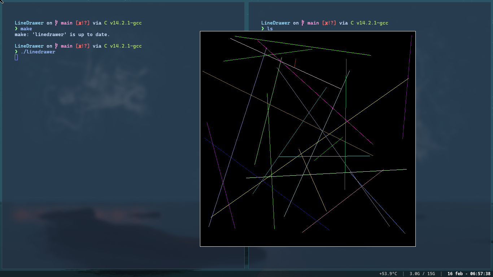

# Line Drawer
## Info
This is a simple program to print some lines into the screen using the random library from C and SDL2. It does have some bugs left.

## Keyboard
"Space" to generate lines, "r" to clear canvas, "j" to do both.

